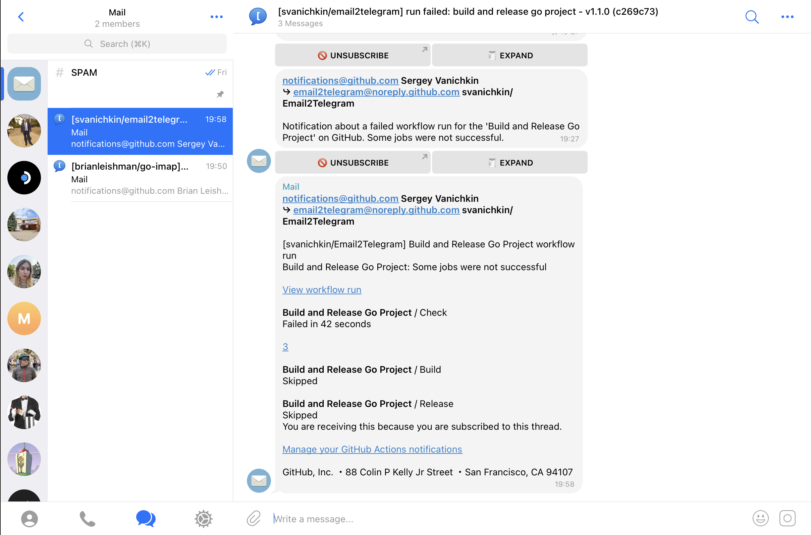

# Email2Telegram

**Email2Telegram** is a powerful and flexible tool that bridges your email inbox with your Telegram account. It allows you to receive new emails directly in a Telegram chat, reply to them, and even compose new emails—all from the convenience of Telegram.

## Features

*   **Email Forwarding:** Automatically forwards incoming emails from your IMAP account to your specified Telegram chat or group.
*   **Telegram Group & Topic Support:** Operates effectively in Telegram groups with topics enabled, automatically creating new topics for new email subjects, thus threading conversations.
*   **Summarized View:** Initially displays emails as concise summaries for quick review.
*   **Interactive Email Management:** Provides "EXPAND" and "UNSUBSCRIBE" buttons directly under email messages.
    *   **Expand Content:** Load and view the full email content directly within the Telegram chat on demand.
    *   **(Placeholder for UNSUBSCRIBE functionality - will clarify in "Usage" or await more info)**
*   **Reply from Telegram:** Easily reply to emails using Telegram's native reply feature (works within topics too).
*   **Compose New Emails:** Send new emails directly from Telegram by messaging your bot.
*   **Attachment Support:** Handles both incoming and outgoing email attachments.
*   **Real-time Notifications:** Utilizes IMAP IDLE for instant notifications of new emails.
*   **Secure Credential Storage:** Protects your email credentials using system keyring or an AES-256 encrypted file.
*   **Configuration File:** Simple and clear configuration via `email2telegram.conf`.
*   **Optional AI-Powered Processing:** Leverage OpenAI for spam detection or code extraction.
*   **Cross-Platform:** Available for Linux, macOS, and Windows.
*   **HTML Email Handling:** Converts HTML emails to Telegram-friendly formatting.
*   **Graceful Shutdown:** Handles termination signals cleanly.
*   **Flexible User Mode:** Supports both single-user (direct chat with bot) and group mode operation.

## How it Works

Email2Telegram performs the following main operations:

1.  **Connects to IMAP:** Establishes a secure connection to your email provider's IMAP server using the credentials you provide.
2.  **Listens for Emails:** Monitors your inbox for new emails, primarily using the IMAP IDLE command for efficiency.
3.  **Parses Emails:** When a new email arrives, it fetches and parses its content, including sender, recipients, subject, body (text and HTML), and attachments.
4.  **Forwards to Telegram:** Sends a formatted summary of the email to your Telegram chat or group.
    *   In group chats with topics enabled, the bot will post the email summary to a topic corresponding to the email's subject. If a topic for that subject doesn't exist, it will create one. This groups email conversations into threads.
    *   Attachments are typically sent as separate messages or links after the main email summary.
5.  **Handles Telegram Interactions:**
    *   **Replies:** When you reply to an email message in Telegram, the bot constructs an email reply and sends it via SMTP.
    *   **New Emails:** When you send a specially formatted message to the bot, it composes and sends a new email via SMTP.

## Installation and Setup

### 1. Download a Release

Pre-compiled binaries for Linux, macOS, and Windows are available on the project's **GitHub Releases page**. Please navigate to the releases section of this repository to download the appropriate archive for your operating system and architecture. Extract the `email2telegram` executable.

### 2. Initial Configuration

Place the `email2telegram` executable in a directory of your choice.

When you run `email2telegram` for the first time, or if the configuration is incomplete, it will guide you through the setup process:

*   **Telegram Bot Token:**
    *   You'll need a Telegram Bot Token. Create a new bot by talking to the [BotFather](https://t.me/BotFather) on Telegram.
    *   Follow its instructions and copy the token it provides.
*   **Telegram User ID (for direct chat mode):**
    *   This is your personal, numeric Telegram User ID. If you plan to use the bot by messaging it directly (not in a group), this is required. The bot will only respond to this user in this mode.
    *   You can get your User ID by sending `/start` to a bot like [IDBot](https://t.me/myidbot) or [@userinfobot](https://t.me/userinfobot).
*   **Telegram Chat ID (for group mode):**
    *   If you intend to use the bot in a Telegram group (especially one with topics), you'll need the group's Chat ID.
    *   To get a group's Chat ID:
        1. Add a bot like [IDBot](https://t.me/myidbot) or [@RawDataBot](https://t.me/RawDataBot) temporarily to your group.
        2. IDBot might send the chat ID directly. For RawDataBot, look for the `chat` object in the JSON, and its `id` field (it will be a negative number).
        3. You can remove the helper bot from the group afterwards.
    *   The `email2telegram` bot will also need to be an administrator in the group to manage topics and messages effectively.
*   **Email Credentials:**
    *   The application will prompt you to enter your email address and password.
    *   These credentials are required to connect to your IMAP and SMTP servers.
    *   **Security:** Your credentials will be stored securely in your system's native keyring. If keyring access fails, they will be stored in an AES-256 encrypted file named `<YourTelegramUserID>.key` in the same directory as the executable.

### 3. The `email2telegram.conf` File

After the initial setup, or if you prefer to configure manually, a configuration file named `email2telegram.conf` will be created in the same directory as the executable. It looks like this:

```ini
[telegram]
token = YOUR_TELEGRAM_BOT_TOKEN
user_id = YOUR_TELEGRAM_USER_ID # Required if not using group mode (chat_id)
# chat_id = YOUR_GROUP_CHAT_ID    # Required for group mode, uncomment and fill

[email]
imap_host = imap.example.com
imap_port = 993
smtp_host = smtp.example.com
smtp_port = 587
# Optional: If your IMAP and SMTP host are the same and use standard ports,
# you might only need to specify your email and password during the interactive setup.
# The application will try to derive hosts from your email address.
# username = your_email@example.com # Can be set here or entered interactively
```

**Configuration Options:**

*   **`[telegram]`**
    *   `token`: Your Telegram bot's API token (Required).
    *   `user_id`: Your numeric Telegram user ID. Required if `chat_id` is not set. The bot will only interact with this user in direct chat mode.
    *   `chat_id`: (Optional) Your numeric Telegram group chat ID. If set, the bot operates in this group. This setting takes precedence over `user_id` for determining where the bot is active. The bot needs admin rights in the group to manage topics.
*   **`[email]`**
    *   `imap_host`: (Optional) Your IMAP server hostname (e.g., `imap.gmail.com`). If left blank, the application will try to derive it from your email domain.
    *   `imap_port`: (Optional) Your IMAP server port. Defaults to `993` (for IMAP over SSL/TLS).
    *   `smtp_host`: (Optional) Your SMTP server hostname (e.g., `smtp.gmail.com`). If left blank, the application will try to derive it from your email domain.
    *   `smtp_port`: (Optional) Your SMTP server port. Defaults to `587` (for SMTP with STARTTLS).
    *   `username`: (Optional) Your full email address. If not provided here, and not found in the keyring from a previous run, you will be prompted for it when the application starts.

### Advanced Email Processing with OpenAI

Email2Telegram can leverage OpenAI's powerful language models to provide advanced processing features for your emails, such as:

*   **Spam Detection:** Help identify and flag potential spam messages.
*   **Code Extraction:** Automatically extract verification codes or other short codes often sent by services and banks.

To enable these features, you need to provide an OpenAI API token:

1.  Obtain an API token from your [OpenAI Platform account](https://platform.openai.com/account/api-keys).
2.  Add or uncomment the `[openai]` section in your `email2telegram.conf` file and enter your token:

    ```ini
    [openai]
    token = YOUR_OPEN_AI_TOKEN
    ```

**Note:** Using OpenAI features may incur costs depending on your OpenAI usage and pricing plan. Please refer to OpenAI's pricing information for details.

**Note on Email Providers (Gmail, Outlook, etc.):**
*   You might need to enable IMAP access in your email account settings.
*   For services like Gmail or Outlook that use OAuth2 or have strong security defaults, you may need to generate an "App Password" to use with Email2Telegram instead of your regular account password.

## Usage

1.  **Run the Application:** Execute `./email2telegram` (or `email2telegram.exe` on Windows) from your terminal in the directory where it's located. Ensure your `email2telegram.conf` is configured for either direct user interaction (`user_id`) or group mode (`chat_id`). If using group mode, make sure the bot is an administrator in the target group and that topics are enabled in the group.

2.  **Receiving Emails:**
    *   New emails will automatically appear as **summary messages** in your Telegram chat (or in a relevant **topic** within your configured group).
    *   **In Group Mode:** If an email's subject matches an existing topic name, the summary will be posted in that topic. Otherwise, a new topic will be created for that subject. This helps keep email conversations organized.
    *   Each email summary message will have two buttons underneath:
        *   **`[EXPAND]`**: Press this button to load and view the full content of the email directly in the chat, below the summary.
        *   **`[UNSUBSCRIBE]`**: Press this button to manage notifications for this email conversation. *(Developer Note: Exact behavior of UNSUBSCRIBE needs confirmation - e.g., mutes future Telegram notifications for this specific email thread/subject, marks as read on server, etc. Please clarify and update this description.)*
    *   Attachments from the email will typically be sent as separate messages or links following the email summary.

3.  **Replying to Emails:**
    *   Use Telegram's "Reply" feature on the message (or summary message) containing the email you want to reply to. If in a group, ensure you are replying within the correct topic.
    *   Type your reply message.
    *   You can attach files/photos/videos to your Telegram reply; they will be sent as email attachments.

4.  **Sending New Emails:**
    *   **In Direct Chat:** Send a message directly to your bot.
    *   **In Group Mode:** You can send a new email by sending a message directly to the bot (if it allows direct messages from you as the configured `user_id` as well) or potentially by posting in a general topic if the bot is designed to pick it up (this interaction might need clarification). For now, direct message to bot is the most reliable.
    *   Use the following format:
        ```
        recipient@example.com
        Subject Line Here
        The body of your new email goes here.
        It can span multiple lines.
        ```
    *   To include attachments, send the text message above first. Then, send the files (photos, documents, etc.) as separate messages immediately after. The application groups media sent in quick succession.

**(Screenshot Placeholder)**


## Contributing

Contributions are welcome! Here are some ways you can help:

*   **Reporting Bugs:** If you find a bug, please open an issue on the GitHub repository, providing as much detail as possible (console output, steps to reproduce, email provider if relevant).
*   **Suggesting Enhancements:** Have an idea for a new feature or an improvement? Open an issue to discuss it.
*   **Pull Requests:** If you'd like to contribute code:
    1.  Fork the repository.
    2.  Create a new branch for your feature or bug fix (`git checkout -b my-new-feature`).
    3.  Make your changes.
    4.  Add tests for your changes. (Currently, the project lacks a comprehensive test suite, which is a key area for improvement!)
    5.  Ensure your code is well-formatted (`go fmt ./...`) and passes linting checks (`golangci-lint run` if a configuration is provided).
    6.  Submit a pull request with a clear description of your changes.

## License

This project is licensed under the terms of the MIT License. See the `LICENSE` file for details.
